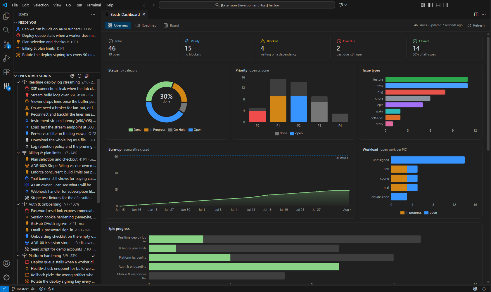
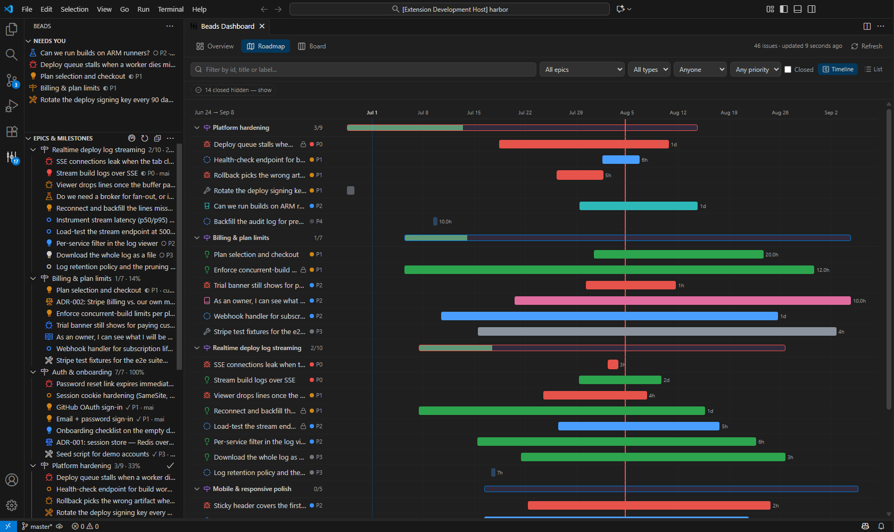
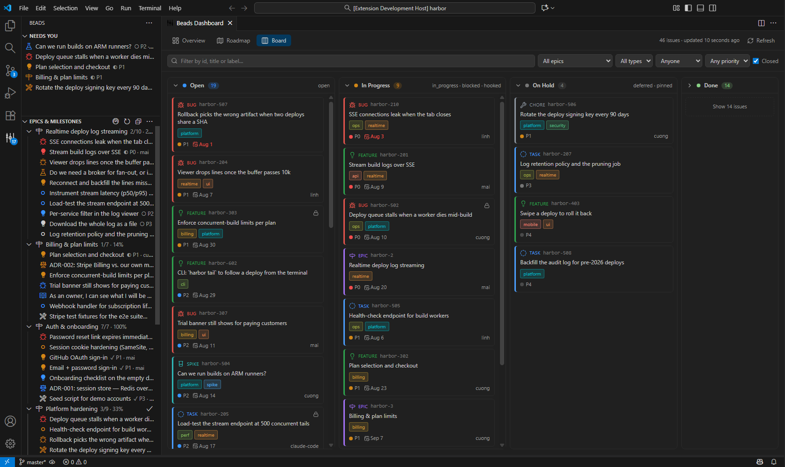
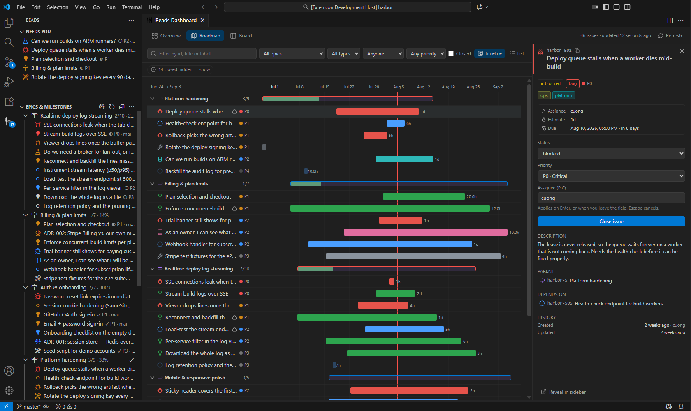
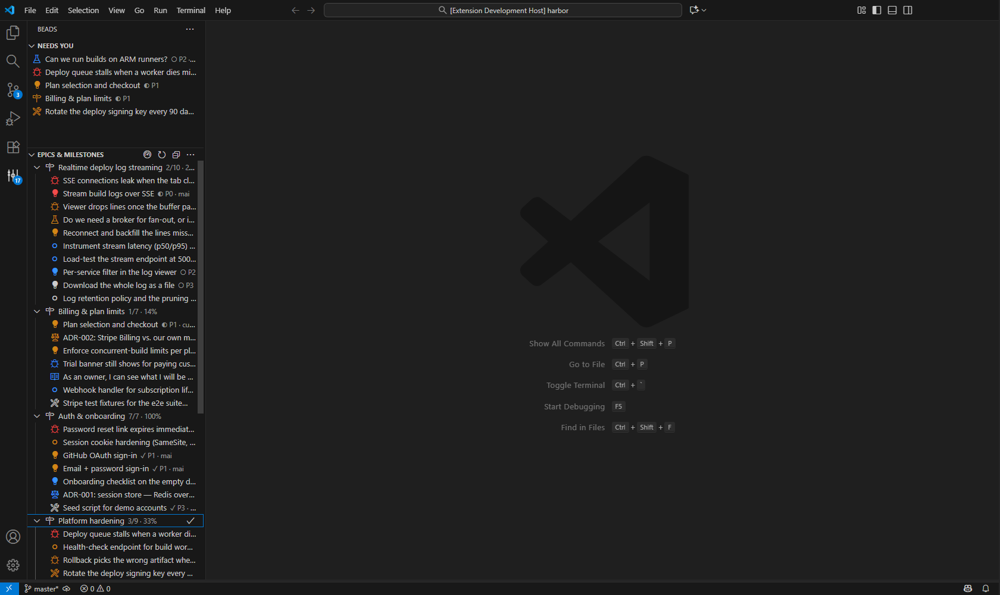

<p align="center">
  
</p>

<h1 align="center">Beads Dashboard for VS Code</h1>

<p align="center">
  Kanban, roadmap and epic tracking for the <a href="https://github.com/steveyegge/beads">Beads</a> git-native issue tracker — inside your editor.
</p>

<p align="center">
  
  
</p>

---


> The last few seconds are the point: nothing is clicked. An agent runs `bd create`
> and `bd update` outside the editor, and the board follows on its own.

## What it does

Beads Dashboard reads your local beads database through the `bd` CLI and renders it three ways:

- **Overview** — totals, a status breakdown, epic progress, and the two lists that matter on
  arrival: what is ready to start, and what is blocked.
- **Roadmap** — Epic → Task drill-down with progress bars and per-epic counts.
- **Board** — a kanban board whose columns are derived from your project's status *categories* at
  runtime. Drag a card to change its status.

Plus an **Epics & Tasks** sidebar with a "Needs You" section, and quick actions (status, priority,
assignee, claim, close) available from the tree, the board and the detail pane.

Everything is read and written through `bd --json`. The extension never reads `.beads/issues.jsonl`
or the Dolt files directly — that export has auto-refresh off by default, and upstream declares
direct readers incompatible.

## See it in action

Every shot below is a real editor against the same mid-flight demo project — five
epics, 46 issues, four people and an agent. It is generated, not curated: `npm run
capture:demo` seeds it and re-takes every image.

**Overview** — totals, status split, priority mix, workload per person, and a
burn-up of everything closed so far:



**Roadmap** — a real timeline with today marked, each epic carrying its own
progress count. Closed work is folded away behind a count you can click:



**Board** — columns derived from your status *categories* at runtime, so a custom
status lands in the right column. Done starts folded:



**Detail pane** — the full issue without leaving the board. Status, priority and
assignee apply as you set them:



**Sidebar** — what needs you on top, then the plan:



## Requirements

- The [`bd` CLI](https://github.com/steveyegge/beads) on your `PATH` (or set `beadsDashboard.bdPath`).
- A workspace folder containing a `.beads` directory. The extension activates only when it finds one.

## Install

Search **Beads Dashboard** in the Extensions view, or:

```bash
code --install-extension cuongbphv.beads-dashboard
```

Using **Cursor**, **Windsurf** or **VSCodium**? Those cannot reach Microsoft's Marketplace, so the
same build is published to [Open VSX](https://open-vsx.org/) and their own Extensions view finds it.
Every release also carries a `.vsix` on the
[Releases page](https://github.com/cuongbphv/beads-ui-vscode-ext/releases) for offline install.

<details>
<summary>Build and install from source instead</summary>

```bash
npm install
npm run install:local     # build → package → install; then reload the window
```

`install:local` auto-detects `code`, `code-insiders`, `cursor`, `windsurf` or `codium`. Force one
with `npm run install:local -- --cli cursor`, or set `VSCODE_CLI`. To produce a `.vsix` without
installing it, pass `-- --skip-install`.

After it finishes: **Ctrl+Shift+P → "Developer: Reload Window"**, then open the Beads icon in the
Activity Bar.

</details>

## Settings

| Setting | Default | What it does |
|---|---|---|
| `beadsDashboard.bdPath` | `bd` | Path to the `bd` executable. |
| `beadsDashboard.defaultTab` | `overview` | Tab the dashboard opens on. |
| `beadsDashboard.issueLimit` | `2000` | Issues loaded per refresh. |
| `beadsDashboard.pollIntervalSeconds` | `5` | How often to check for changes made outside the editor. `0` disables it. |
| `beadsDashboard.showClosed` | `true` | Include closed issues in the board and tree. |
| `beadsDashboard.assignee` | `""` | Who you are, for **Needs You**. Empty means the identity `bd` itself would use. |

Changes made outside the editor — by an agent, a teammate, or your own terminal — show up on
their own within a few seconds. That check is one `bd list --limit 1`, and the full reload only
runs when something actually changed; nothing is checked at all while every Beads view is hidden
or the window is in the background. Set `pollIntervalSeconds` to `0` if you would rather the
extension spawn nothing you did not ask for.

## Commands

| Command | Where |
|---|---|
| `Beads: Open Dashboard` | Palette, view title |
| `Beads: Refresh` | Palette, view title |
| `Beads: Show bd Output Log` | Palette — every argv and every failure lands here |
| Change status / priority / assignee, Claim, Close, Copy ID | Tree context menu, detail pane |

## Development

```bash
npm run watch        # rebuild both bundles on change
npm run verify       # lint + typecheck + test + build + npm audit
npm test             # vitest
npm run demo:seed    # build the throwaway "Harbor" demo workspace
npm run capture:demo # seed it, then refresh docs/screenshots/ from a real editor
npm run gif          # seed it, then record docs/screenshots/demo.gif
npm run preview      # render the dashboard in Chromium at 420/900/1440px
```

Every image in this README comes from `capture:demo` / `gif`, never from a hand-posed editor.
The demo project is a fixture in [`scripts/lib/demo-project.mjs`](scripts/lib/demo-project.mjs),
seeded through `bd import` into a throwaway workspace in your temp directory — the extension's own
tracker is nearly all closed, and screenshots taken against it make a live tool look finished. The
unit suite asserts the fixture stays mid-flight rather than drifting back into a graveyard.

These, `capture` and `preview` all drive live `bd --json` output, so they need the `bd` CLI
locally. That is why they do not run in CI. `gif` also needs `ffmpeg` on your `PATH`.

### Releasing

Tag a commit and push it — [`.github/workflows/release.yml`](.github/workflows/release.yml) builds the
`.vsix`, attaches it to a GitHub Release, then publishes that exact file to the VS Code Marketplace
and to Open VSX. The tag must match `version` in `package.json` or the workflow fails before
building.

```bash
npm run verify       # the workflow cannot run the bd-backed tests; do it here
git tag v0.1.0
git push origin v0.1.0
```

Publishing needs two repository secrets. Each publish step is skipped with a warning when its token
is missing, so a fork still gets a working `.vsix` release:

| Secret | Where it comes from |
|---|---|
| `VSCE_PAT` | An Azure DevOps PAT with the **Marketplace: Manage** scope. The `publisher` in `package.json` must exist first at [Manage Publishers](https://marketplace.visualstudio.com/manage). |
| `OVSX_PAT` | An [Open VSX access token](https://open-vsx.org/user-settings/tokens). Create the namespace once with `npx ovsx create-namespace cuongbphv -p <token>`. |

Architecture, decisions and the task roadmap live in [`.velox/`](.velox/); the agent rule set is
[`.velox/docs/VELOX-CONTEXT.md`](.velox/docs/VELOX-CONTEXT.md).

The call chain is one-directional, and no layer may be skipped:

```
view → hook → bridge/rpc.ts → [postMessage] → panel router → bd/queries|mutations → BdService → bd
```

```
src/extension/   Extension host — the only place that spawns bd or imports `vscode`
  bd/            BdService (spawn), queries (reads), mutations (writes)
  panel/         DashboardPanel (CSP + nonce) and the RPC router
  tree/          Epic → Task sidebar
src/shared/      Framework-free: types, RPC protocol, and the model derivations
src/webview/     React UI. Never touches child_process, fs, or the network
  bridge/rpc.ts  The single caller of acquireVsCodeApi()
media/           Extension icon and activity-bar glyph
```

`src/shared/` is the only code both sides import, so "what counts as done" means the same thing in
the sidebar and on the board.

## Design system

Design decisions are not ad-hoc — read [design-system/MASTER.md](design-system/MASTER.md) before
touching UI code. The rules that most often get violated:

- **No remote fonts or CDN assets.** The webview CSP blocks external hosts; use
  `var(--vscode-font-family)`.
- **No hardcoded hex colors.** The user's theme is the source of truth; map to `--vscode-*`.
- **Container queries, not media queries.** A panel can be 400px wide in a 2560px window.
- **Card content budget** — a card shows exactly four things: id, truncated title, type icon,
  priority dot. Status is the column it sits in, not a badge.
- **Never color alone** for status or priority — always color *plus* icon or text.
- **Icons from `lucide-react` only.** No emoji as icons.

## Tech stack

VS Code Extension API · TypeScript 6 · React 19 · Tailwind CSS 4 (CSS-first `@theme`) · `dnd-kit` ·
`lucide-react` · esbuild (dual bundle) · vitest

## Related projects

- **[Beads CLI](https://github.com/steveyegge/beads)** — the git-native issue tracker this UI wraps

## License

MIT — see [LICENSE](LICENSE). Copyright (c) 2026 Bùi Phan Viết Cường.
